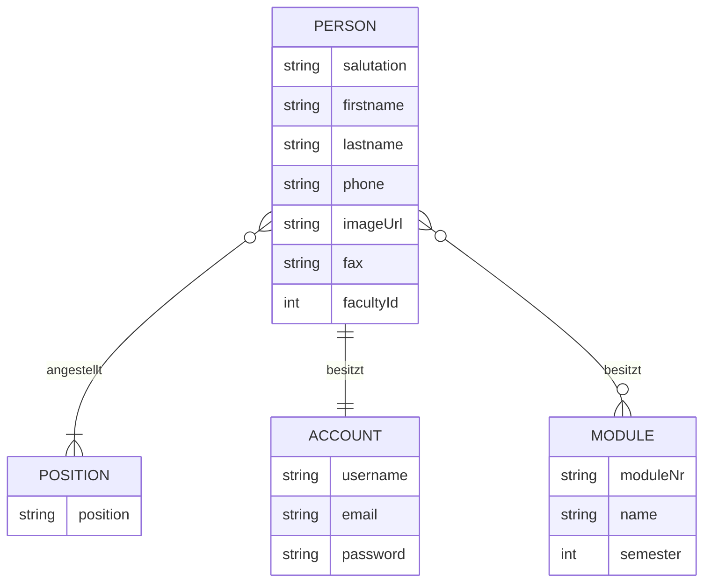

# Dokumentation

## 1 Anforderungsspezifikation 

## Service Übersicht

- Beinhaltet alle Informationen und Funktionen zur Kontaktaufnahme mit den Lehrenden an der FHE.
- Ermöglicht eine intuitive Suche nach Personen nach bestimmten Filter- und Sortierkriterien.
- Bietet eine Übersicht über die für Studierende relevanten Personen.
- Ermöglicht das erstellen und verwalten von eigenen Nutzeraccounts.

## User stories

- (U1) Als Angestellter der FHE möchte ich meine Daten im System erstellen, ändern und löschen können.
- (U2) Als Angestellter der FHE möchte ich mir einen Account erstellen können, mit dem ich diese Daten pflegen kann.
- (U3) Als Dozent möchte ich einstellen können, welche Fächer ich in welchem Semester derzeitig unterrichte.
- (U4) Als Studierender möchte ich Angestellte der FHE suchen können.
- (U5) Als Studierender möchte ich bei der Suche nach Name, Fakultät und Position filtern können.
- (U6) Als Studierender möchte ich Lehrende auch durch Angabe meines Studienganges und Semester finden können.
- (U7) Als Studierender möchte ich alle Suchergebnisse nach verschiedenen Kriterien sortieren können.
- (U8) Als Studierender möchte ich Angestellte der FHE abspeichern können.
- (U9) Als Studierender erwarte ich, dass ein Suchverlauf erstellt wird.

Dabei werden (U8) und (U9) nicht in diesem Service implementiert. Beide User stories werden lokal in der App 
implementiert und sind deswegen an dieser Stelle nicht zu beachten.

# 2 Modellierung

## Anwendungsfälle

## Entity Relationship Diagram

