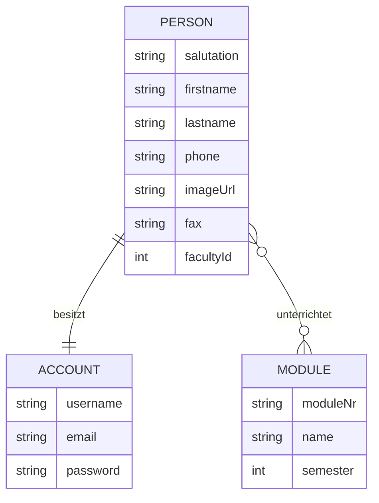

# Dokumentation

## 1 Anforderungsspezifikation 

## Service Übersicht

- Beinhaltet alle Informationen und Funktionen zur Kontaktaufnahme mit den Lehrenden an der FHE.
- Ermöglicht eine intuitive Suche nach Personen nach bestimmten Filter- und Sortierkriterien.
- Bietet eine Übersicht über die für Studierende relevanten Personen.
- Ermöglicht das erstellen und verwalten von eigenen Nutzeraccounts.

Der folgende service könnte wie in folgendem mockup in der späteren app verwendet werden:


## User stories

- (U1) Als Angestellter der FHE möchte ich meine Daten im System erstellen, ändern und löschen können.
- (U2) Als Angestellter der FHE möchte ich mir einen Account erstellen können, mit dem ich diese Daten pflegen kann.
- (U3) Als Dozent möchte ich einstellen können, welche Fächer ich in welchem Semester derzeitig unterrichte.
- (U4) Als Studierender möchte ich Angestellte der FHE suchen können.
- (U5) Als Studierender möchte ich bei der Suche nach Name, Fakultät und Position filtern können.
- (U6) Als Studierender möchte ich Lehrende auch durch Angabe meines Studienganges und Semester finden können.
- (U7) Als Studierender möchte ich alle Suchergebnisse nach verschiedenen Kriterien sortieren können.
- (U8) Als Studierender möchte ich Angestellte der FHE abspeichern können.
- (U9) Als Studierender erwarte ich, dass ein Suchverlauf erstellt wird.

Dabei werden (U8) und (U9) nicht in diesem Service implementiert. Beide User stories werden lokal in der App 
implementiert und sind deswegen an dieser Stelle nicht zu beachten.

# 2 Modellierung

## Anwendungsfälle


## Entity Relationship Diagram



# 3 Structure
## Folder

### `person-client`
Person class logic
### `person-service`
Database logic and creation
### `web`
The Webserver with routes

## Person Data Transfer Object Class
```Java
class person {
    private Long id = 0L;
    private Long version;
    private String salutation;
    private String firstname;
    private String lastname;
    private String phone;
    private String fax;
    private int facultyId;
    private List<String> titles;
    private List<String> positions;
    private AccountDto account;
    private ImageDto profileImage;
}
```
## Account Data Transfer Object Class
```Java
class account {    
    private Long id = 0L;
    private Long version;
    private String username;
    private String email;
    private String password;
}
```
## Image Data Transfer Object Class
```Java
class Image {
    private Long id = 0L;
    private Long version;
    private String name;
    private String suffix;
    private byte[] content;
}
```


# 4 HTTP Requests

### A complete person
```json
{
  "id": 4,
  "salutation": "Frau",
  "firstname": "Gerd",
  "lastname": "Faunch",
  "phone": "01575 31834128",
  "fax": "04613 18231247",
  "facultyId": 42,
  "titles": [
    "Dr",
    "Prof"
  ],
  "positions": [
    "Dozentin"
  ],
  "account": {
    "id": 5,
    "version": 0,
    "username": "CorissaFaunch42",
    "email": "cfaunch0@symantec.com",
    "password": "1234"
  },
  "profileImage": {
    "id": null,
    "version": null,
    "name": "4",
    "suffix": "jpg",
    "content": null
  }
}
```

## Get greeting from server
```http
GET http://localhost:8080/api/
Accept: text/plain
```
## Create a person
```http
POST http://localhost:8080/api/persons
Content-Type: application/json
```
### Example
```json
{
  "firstname": "Gerd",
  "lastname": "Faunch",
  "salutation": "Frau",
  "phone": "01575 31834128",
  "fax": "04613 18231247",
  "titles": ["Dr", "Prof"],
  "positions": ["Dozentin"],
  "facultyId": 42,
  "account": {
    "username": "CorissaFaunch42",
    "email": "cfaunch0@symantec.com",
    "password": "1234"
  }
}
```
## Get all persons
```http
GET http://localhost:8080/api/persons
Accept: application/json
```

## Get person by id
```http
GET http://localhost:8080/api/persons/:personId
Accept: application/json
```
### Example
```
http://localhost:8080/api/persons/1
```

## Update person
```http
PUT http://localhost:8080/api/persons/:personId
Content-Type: application/json
```
### Example
```
http://localhost:8080/api/persons/1

{
  "firstname": "Friedrich"
}
```
## Update profile image
```http
PUT http://localhost:8080/api/persons/1/profile-image?suffix=:filesuffix&name=:filename
Content-Type: application/octet-stream
```
### Example
needs file to upload
```bash
# queries
?suffix=png
&name=mypicture
```

## Delete person
```http
DELETE http://localhost:8080/api/persons/:personId
```
### Example
```
DELETE http://localhost:8080/api/persons/1
```
